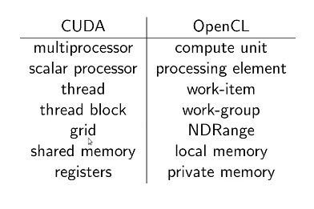
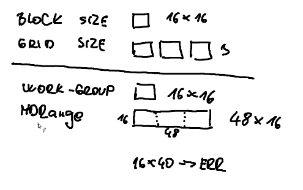
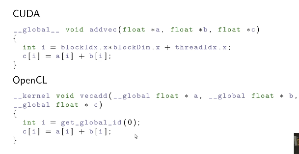
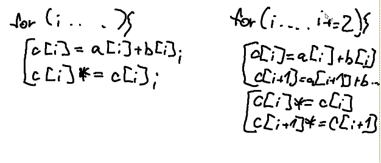
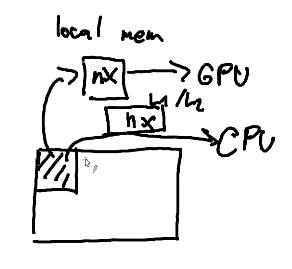
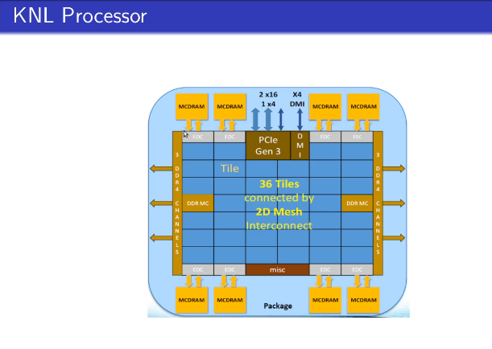

# OpenCL

- can be used for heterogenous systems and different GPUs
  - one implementation can be compiled for different types of HW
  - but we still need to optimize it for specific architectures to achieve the best performance
- open standard, independent of a single company
- more complex API
- less mature implementation
- slower incorporation of new HW features

## CUDA vs OpenCL

- OCL is a library, not an extension of the language
- it is stored as a string, which is compiled during program execution
  - I have a function which compiles the code
- kernels do not use pointers
- no C++ stuff
- OCL uses Queues to support multiple HW
- 
  - NDRange
    - how many threads do I have alltogether
    - the number of work-groups can be derived from NDRange
    - this way, we can ommit the definition of the **work-group**
    - 
  - Shared memory (CUDA), Local memory (OpenCL)
  - registers (CUDA), private memory (OpenCL)
- Basic vecadd kernel
  - 
  - Host code - waay more complicated than CUDA
    - define a platform
      - device
      - context
      - queues - each device needs at least one queue
    - allocate and copy data
      - lazy copying
    - compile the kernel code
      - compile the whole program from string
      - create a `cl_kernel` by specifying the function name
      - specify kernel arguments by `clSetKernelArg`
    - configure the kernel and execute it
    - cleanup

## AMD GPU Architecture

- **VeryLongIntstructionWord** architecture
  - word includes several independent operations
  - `[add|add|add|sin]`
  - generated during compilation
  - compiler has to be aware, that some operations are independent
  - each thread executes multiple instructions
    - can be extremely efficient, but also suffer a lot in case of branching
    - *natural for graphical workflow*
      - *everything is applied for 3D (rgb)*
  - **Optimizations for VLIW**
    - explicit vectorization (float4)
    - implicit vectorization
      - we can help the compiler by unrolling loops and grouping similar operations
      - 
  - **Issues with VLIW**
    - we need much more registers for using VLIW - **keep the number of used registers low**
    - branching now wastes much more resources
    - 64 threads now run in lockstep
- two global memory access modes
  - **fast path**
    - significantly faster
    - can be used only for load/store of **32-bit** values
    - has to be statically determined before executing the code
      - compiler is always conservative - rather generates slower code than wrong code
  - **complete path**
    - used for everything other
- **less sensitive to misaligned access**
  - all threads within wavefront **should use the same channel** (they should be aligned)
    - aligned contiguous block of 32-bit elements is in one channel
  - misaligned access is compensated by the cache
- more sensitive to partition camping
  - wavefront (aka warp) has **64 threads**
  - in different wavefront we should use different channels and different banks'
    - *one bank consists of multiple channels, one channel has e.g. 256 B*
- Local  Data Storage
  - composed of 32 or 16 banks
- AMD Graphic Core Next
  - one scalar processor and four vector processors
  - concurrent kernel invocations

## x86 CPU

- core is complex, out-of-order instruction execution, large cache
- Intel processors - 64 B cachelines
- beware of NUMA
- no local memory in HW - the CPU would just allocate another array in the global memory
  - but good to access the global memory as shared memory **to keep the data in caches**
  - 

## Intel MIC

- Many Integrated Core Architecture
- 

- core
  - extremely simple
  - slow in serial computation
  - **vector unit is on steroids**
    - 512-bit vectors
- Programming Models
  - Native programming model
  - Offload programming model
- high need for parallelism

## Optimizations

- work group size
  - we are on CPU, we **do not need high parallelism to mask memory latency**
  - do not set the size too big - to use registers instead of cache
- avoid pointer arithmetics, use array indexing
  - more transparent for the compiler
  - don't use size_t (64-bit) but rather int (32-bit)
- use cache-blocking, do not exceed L2 cache
- AoS vs SoA